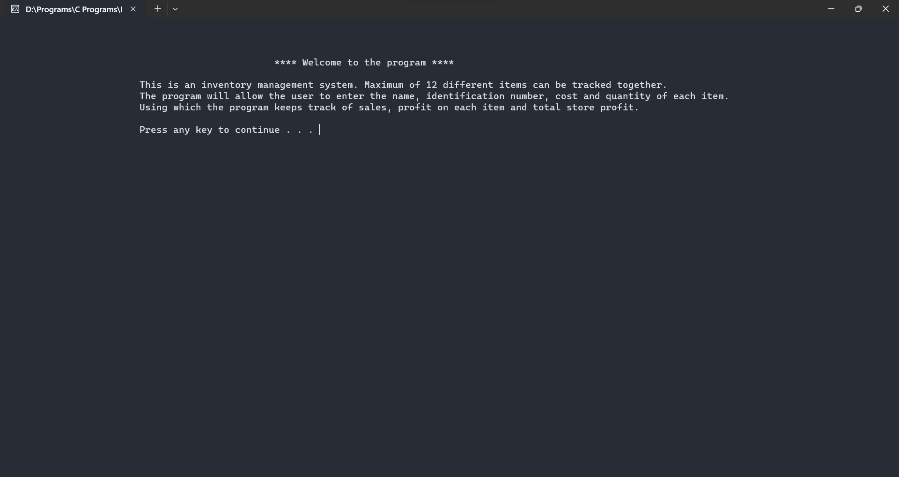
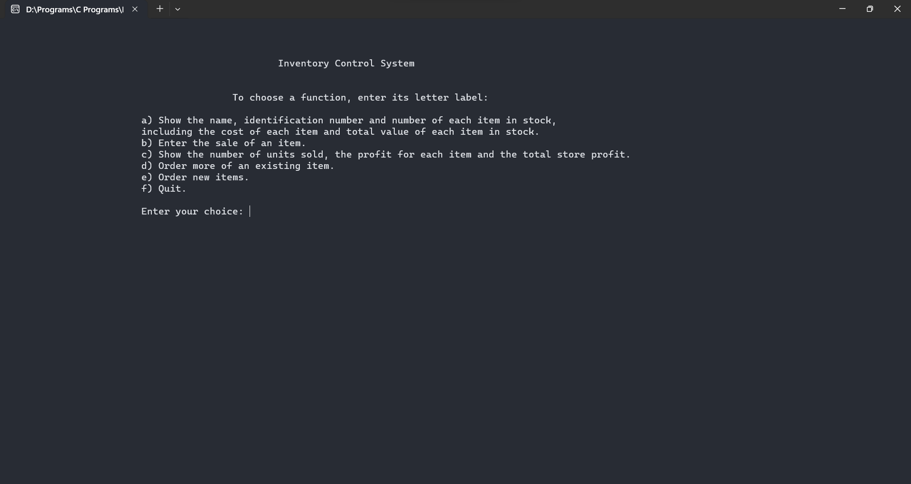

       

# Inventory Management System Documentation
## Introduction
The Inventory Management System is a console-based application designed to help businesses track and manage their inventory. This program allows users to enter information such as item name, identification number, cost, and quantity. It then performs various functions, including tracking sales, calculating profits, and managing stock levels.

## Features
1. **Show Inventory:**
   - Display the name, identification number, quantity, unit cost, and total value of each item in stock.

2. **Add Sale:**
   - Record the sale of an item by entering the item's ID and the number of units sold.
   - Update the item's quantity, sales, and profit information.

3. **Show Sales:**
   - Display the number of units sold, profit for each item, and the total store profit.

4. **Order Existing Item:**
   - Replenish stock by specifying the item's ID and the number of units to be ordered.
   - Update the item's quantity.

5. **Order New Item:**
   - Add a new item to the inventory by entering its name, ID, cost, and quantity.
   - Checks for duplicate item IDs to maintain uniqueness.

6. **File Handling:**
   - Reads and writes inventory data to a file (`inventory.dat`) for data persistence.

## Usage
1. Run the program - `InventoryManagementSystem.exe`
2. Choose a function by entering the corresponding letter:
   - **a:** Show Inventory
   - **b:** Add Sale
   - **c:** Show Sales
   - **d:** Order Existing Item
   - **e:** Order New Item
   - **f:** Quit

3. Follow the prompts to perform the selected function.

## File Handling
- The program uses file handling to store and retrieve inventory data.
- The file, `inventory.dat`, is created if it doesn't exist and is used for data persistence.

## Input Validation
- The program includes input validation to ensure that users enter valid data.
- Users are prompted to re-enter values if their inputs are not valid.

## Authors
The Inventory Management System was developed by Akshat Dodhiya.

## Notes
- The program does not handle units. Ensure that input values are consistent in their units for accurate results.

## Version Information
- Version: 1.0
- Date: December 7, 2023

## Welcome Screen

## Main Menu

## Usage Instructions
1. Run the program.
2. Choose a function from the main menu.
3. Follow the prompts to perform the selected operation.
4. To exit the program, select option 'f' from the main menu.

**Thank you for using the Inventory Management System!**
